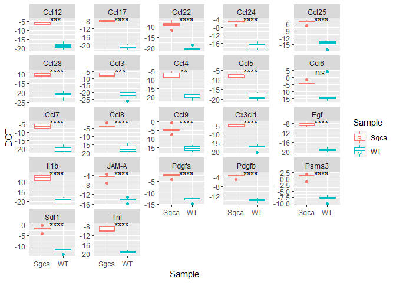
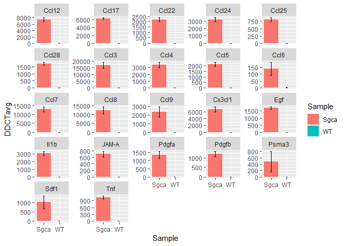

Example workflow qPCRanalysis
================
Jordi Camps
April 17 2019

## Load packages

``` r
library(readxl)
library(tidyr)
library(dplyr)
library(ggplot2)
library(qPCRanalysis)
library(ggpubr)
library(lazyeval)
```

## Load data

We load the data with the **read\_excel()** function of the readxl
package. The data should consist of at least 4 columns:

  - **Sample** : the biological variability in your data set like a
    disease, different timepoints, perturbation …
  - **Replicate** : invidividual names per sample
  - **Gene** : the gene names of your primers
  - **CT** : the raw CT
values

<!-- end list -->

``` r
qpcr <- read_excel("vignette/qPCR_data.xlsx", col_names = TRUE, sheet = 3, skip = 35)
head(qpcr)
```

    ## # A tibble: 6 x 35
    ##    Well `Well Position` Omit  `Sample Name` `Target Name` Task  Reporter
    ##   <dbl> <chr>           <lgl> <chr>         <chr>         <chr> <chr>   
    ## 1     1 A1              FALSE WT_1          Tnf           UNKN~ SYBR    
    ## 2     2 A2              FALSE WT_1          Il1b          UNKN~ SYBR    
    ## 3     3 A3              FALSE WT_1          Ccl3          UNKN~ SYBR    
    ## 4     4 A4              FALSE WT_1          Ccl4          UNKN~ SYBR    
    ## 5     5 A5              FALSE WT_1          Ccl5          UNKN~ SYBR    
    ## 6     6 A6              FALSE WT_1          Ccl6          UNKN~ SYBR    
    ## # ... with 28 more variables: Quencher <chr>, CT <chr>, `Ct Mean` <dbl>,
    ## #   `Ct SD` <lgl>, Quantity <lgl>, `Quantity Mean` <lgl>, `Quantity
    ## #   SD` <lgl>, `Automatic Ct Threshold` <lgl>, `Ct Threshold` <dbl>,
    ## #   `Automatic Baseline` <lgl>, `Baseline Start` <dbl>, `Baseline
    ## #   End` <dbl>, Comments <lgl>, `Y-Intercept` <lgl>, `R(superscript
    ## #   2)` <lgl>, Slope <lgl>, Tm1 <dbl>, Tm2 <dbl>, Tm3 <lgl>,
    ## #   Custom1 <lgl>, Custom2 <lgl>, Custom3 <lgl>, Custom4 <lgl>,
    ## #   Custom5 <lgl>, Custom6 <lgl>, EXPFAIL <chr>, THOLDFAIL <chr>,
    ## #   MTP <chr>

Now we need to clean the data frame. We will select only the columns
that we need and change their names because R does not like spaces
inside column names.

``` r
qpcr <- select(qpcr, c("Sample Name", "Target Name", "CT"))
colnames(qpcr) <- c("Sample", "Gene", "CT")
head(qpcr)
```

    ## # A tibble: 6 x 3
    ##   Sample Gene  CT                
    ##   <chr>  <chr> <chr>             
    ## 1 WT_1   Tnf   33.277999877929688
    ## 2 WT_1   Il1b  33.993999481201172
    ## 3 WT_1   Ccl3  Undetermined      
    ## 4 WT_1   Ccl4  Undetermined      
    ## 5 WT_1   Ccl5  32.437000274658203
    ## 6 WT_1   Ccl6  29.705999374389648

In this example we want to see the difference between different
genotypes. We will split the Sample Name column in
two.

``` r
qpcr <- separate(qpcr, col = Sample, into = c("Sample", "Replicate"), sep = "_")
```

    ## Warning: Expected 2 pieces. Missing pieces filled with `NA` in 24 rows
    ## [265, 266, 267, 268, 269, 270, 271, 272, 273, 274, 275, 276, 277, 278, 279,
    ## 280, 281, 282, 283, 284, ...].

``` r
qpcr <- filter(qpcr, Sample != "Blanc")
head(qpcr)
```

    ## # A tibble: 6 x 4
    ##   Sample Replicate Gene  CT                
    ##   <chr>  <chr>     <chr> <chr>             
    ## 1 WT     1         Tnf   33.277999877929688
    ## 2 WT     1         Il1b  33.993999481201172
    ## 3 WT     1         Ccl3  Undetermined      
    ## 4 WT     1         Ccl4  Undetermined      
    ## 5 WT     1         Ccl5  32.437000274658203
    ## 6 WT     1         Ccl6  29.705999374389648

When we check the structure of the data frame we see that the CT column
is not numeric, we will change this. In addition, all undetermined
values are switched to NA. If desired, these values can be changed to
40.

``` r
qpcr$CT <- as.numeric(qpcr$CT)
```

    ## Warning: NAs introduced by coercion

``` r
str(qpcr)
```

    ## Classes 'tbl_df', 'tbl' and 'data.frame':    264 obs. of  4 variables:
    ##  $ Sample   : chr  "WT" "WT" "WT" "WT" ...
    ##  $ Replicate: chr  "1" "1" "1" "1" ...
    ##  $ Gene     : chr  "Tnf" "Il1b" "Ccl3" "Ccl4" ...
    ##  $ CT       : num  33.3 34 NA NA 32.4 ...

## Calculate Delta CT

To calculate delta CT we use the `calculate_DCT()` function. This
function requires four arguments:

  - **df** : dataframe structured like the proposed data file
  - **hkg** : name of housekeeping gene or genes that you want to use to
    normalize against
  - **sample\_col** : name of the sample column
  - **gene\_col** : name of the gene column

It will pass a dataframe with three added columns:

  - **CT\_hkg** : average CT value of housekeeping genes
  - **DCT** : Delta CT values
  - **RE** : relative expression to
hkg

<!-- end list -->

``` r
qpcr <- calculate_DCT(df = qpcr, hkg = c("Rab35", "Rpl13a", "PSma3"), sample_col = "Sample", gene_col = "Gene")
```

    ## Joining, by = "Sample"

    ## # A tibble: 242 x 7
    ## # Groups:   Sample [2]
    ##    Sample Replicate Gene     CT CT_hkg   DCT           RE
    ##    <chr>  <chr>     <chr> <dbl>  <dbl> <dbl>        <dbl>
    ##  1 WT     1         Tnf    33.3   13.0 -20.3  0.000000761
    ##  2 WT     1         Il1b   34.0   13.0 -21.0  0.000000463
    ##  3 WT     1         Ccl3   NA     13.0  NA   NA          
    ##  4 WT     1         Ccl4   NA     13.0  NA   NA          
    ##  5 WT     1         Ccl5   32.4   13.0 -19.5  0.00000136 
    ##  6 WT     1         Ccl6   29.7   13.0 -16.8  0.00000904 
    ##  7 WT     1         Ccl7   34.6   13.0 -21.7  0.000000302
    ##  8 WT     1         Ccl8   30.5   13.0 -17.5  0.00000535 
    ##  9 WT     1         Ccl9   29.7   13.0 -16.7  0.00000918 
    ## 10 WT     1         Ccl12  32.3   13.0 -19.4  0.00000145 
    ## # ... with 232 more rows

``` r
head(qpcr)
```

    ## # A tibble: 6 x 7
    ## # Groups:   Sample [1]
    ##   Sample Replicate Gene     CT CT_hkg   DCT           RE
    ##   <chr>  <chr>     <chr> <dbl>  <dbl> <dbl>        <dbl>
    ## 1 WT     1         Tnf    33.3   13.0 -20.3  0.000000761
    ## 2 WT     1         Il1b   34.0   13.0 -21.0  0.000000463
    ## 3 WT     1         Ccl3   NA     13.0  NA   NA          
    ## 4 WT     1         Ccl4   NA     13.0  NA   NA          
    ## 5 WT     1         Ccl5   32.4   13.0 -19.5  0.00000136 
    ## 6 WT     1         Ccl6   29.7   13.0 -16.8  0.00000904

## Statistics

Perform statistical test between two groups and add information to qpcr
data frame. We will do this with the ggpubr
package.

``` r
stat <- compare_means(DCT ~ Sample, qpcr, method = "t.test", paired = FALSE, group.by = "Gene")
head(stat)
```

    ## # A tibble: 6 x 9
    ##   Gene  .y.   group1 group2          p    p.adj p.format p.signif method
    ##   <chr> <chr> <chr>  <chr>       <dbl>    <dbl> <chr>    <chr>    <chr> 
    ## 1 Tnf   DCT   WT     Sgca   0.0000136  0.00012  1.4e-05  ****     T-test
    ## 2 Il1b  DCT   WT     Sgca   0.00000243 0.000039 2.4e-06  ****     T-test
    ## 3 Ccl3  DCT   WT     Sgca   0.000518   0.0016   0.00052  ***      T-test
    ## 4 Ccl4  DCT   WT     Sgca   0.00204    0.0041   0.00204  **       T-test
    ## 5 Ccl5  DCT   WT     Sgca   0.0000213  0.000150 2.1e-05  ****     T-test
    ## 6 Ccl6  DCT   WT     Sgca   0.140      0.14     0.14021  ns       T-test

### Plot

``` r
ggplot(qpcr, aes(x = Sample, y = DCT, col = Sample)) +
  geom_boxplot() +
  facet_wrap(~Gene, scales = "free_y") +
  stat_compare_means(method = "t.test", label = "p.signif", label.x = 1.5)
```

    ## Warning: Removed 26 rows containing non-finite values (stat_boxplot).

    ## Warning: Removed 26 rows containing non-finite values (stat_compare_means).

<!-- -->

## Calculate Delta Delta CT

To calculate Delta Delta CT use the `calculate_DDCT()` function. This
function can only be run after the `calculate_DCT()` function is used
and requires five argeuments:

  - **df**: dataframe structured like the proposed data file, has to
    contain DCT and RE column
  - **gene\_col** : name of the gene column
  - **sample\_col** : name of the sample column
  - **var\_col** : column name of variables to normalize your control
    against
  - **control**: name of variable to use as control

It will pass a dataframe with seven added columns

  - **DCTavg** : average Delta CT value
  - **DCTsem** : s.e.m. of Delta CT
  - **DCTsemperc** : percentage of s.e.m.
  - **DDCTavg** : average Delta Delta CT value
  - **DDCTsem** : standard error to the mean of Delta Delta CT
  - **DDCTmin** : minimum sem value
  - **DDCTmax** : maximum sem
value

<!-- end list -->

``` r
ddct <- calculate_DDCT(df = qpcr, gene_col = "Gene", sample_col = "Sample", var_col = "Sample", control = "WT")
head(ddct)
```

    ## # A tibble: 6 x 9
    ##   Gene  Sample DCTavg DCTsem DCTsemperc DDCTavg  DDCTsem  DDCTmin DDCTmax
    ##   <chr> <chr>   <dbl>  <dbl>      <dbl>   <dbl>    <dbl>    <dbl>   <dbl>
    ## 1 Ccl12 Sgca    -6.04  0.464      -7.68   7423. 645.     6779.    8068.  
    ## 2 Ccl12 WT     -18.9   0.765      -4.05      1    0.0572    0.943    1.06
    ## 3 Ccl17 Sgca    -8.38  0.248      -2.97   6290. 227.     6063.    6517.  
    ## 4 Ccl17 WT     -21.0   0.430      -2.05      1    0.0289    0.971    1.03
    ## 5 Ccl22 Sgca    -9.08  0.801      -8.82   2183. 199.     1985.    2382.  
    ## 6 Ccl22 WT     -20.2   0.443      -2.20      1    0.0311    0.969    1.03

### Plot

``` r
ggplot(ddct, aes(x = Sample, y = DDCTavg, fill = Sample)) +
  geom_col() +
  geom_errorbar(aes(ymin = DDCTmin, ymax = DDCTmax), width = 0.1, data = ddct) +
  facet_wrap(~Gene, scales = "free_y")
```

<!-- -->

# Export

At any given point you can export the data frame to an excel file with
this function. Here we will export the data in an excel with three
sheets. The first sheet will contain your raw values and normalized
delta CT values. The second sheet will contain your statistics. The
third sheet will contain all the values normalized to your control
group.

``` r
library(WriteXLS)
WriteXLS(c("qpcr", "stat", "ddct"), "vignette/qpcr.xlsx")
```
