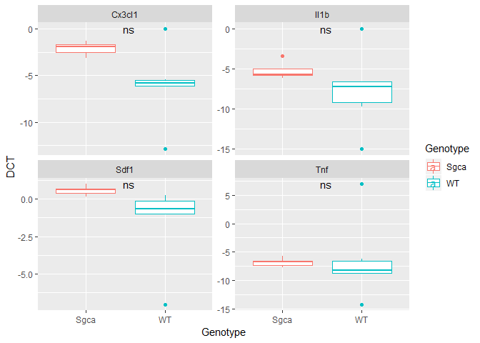

qPCRanalysis
================
Jordi Camps
May 10 2019

## Installation

Install following packages

``` r
if(!require(tidyverse)) install.packages("tidyverse")
if(!require(ggpubr)) install.packages("ggpubr") 
if(!require(lazyeval)) install.packages("lazyeval")
if(!require(WriteXLS)) install.packages("WriteXLS")
if(!require(devtools)) install.packages("devtools")
if(!require(qPCRanalysis)) devtools::install_github("SCIL-leuven/qPCRanalysis")
```

## Load packages

``` r
library(tidyverse)
library(readxl)
library(qPCRanalysis)
library(ggpubr)
library(lazyeval)
```

## Load data

We load the data with the **read\_excel()** function of the readxl
package. The data should consist of at least 4 columns:

  - **Sample** : invidividual names per sample
  - **Gene** : the gene names of your primers
  - **CT** : the raw CT values
  - **A grouping variable** : the biological variability in your data
    set like a disease, different timepoints, perturbation
…

<!-- end list -->

``` r
qpcr <- read_excel("vignette/qPCR_data.xlsx", col_names = TRUE, sheet = 3, skip = 35)
head(qpcr)
```

    ## # A tibble: 6 x 35
    ##    Well `Well Position` Omit  `Sample Name` `Target Name` Task  Reporter
    ##   <dbl> <chr>           <lgl> <chr>         <chr>         <chr> <chr>   
    ## 1     1 A1              FALSE WT_1          Tnf           UNKN~ SYBR    
    ## 2     2 A2              FALSE WT_1          Il1b          UNKN~ SYBR    
    ## 3    16 A16             FALSE WT_1          Sdf1          UNKN~ SYBR    
    ## 4    17 A17             FALSE WT_1          Cx3cl1        UNKN~ SYBR    
    ## 5    22 A22             FALSE WT_1          Rpl13a        UNKN~ SYBR    
    ## 6    25 B1              FALSE WT_2          Tnf           UNKN~ SYBR    
    ## # ... with 28 more variables: Quencher <chr>, CT <chr>, `Ct Mean` <dbl>,
    ## #   `Ct SD` <lgl>, Quantity <lgl>, `Quantity Mean` <lgl>, `Quantity
    ## #   SD` <lgl>, `Automatic Ct Threshold` <lgl>, `Ct Threshold` <dbl>,
    ## #   `Automatic Baseline` <lgl>, `Baseline Start` <dbl>, `Baseline
    ## #   End` <dbl>, Comments <lgl>, `Y-Intercept` <lgl>, `R(superscript
    ## #   2)` <lgl>, Slope <lgl>, Tm1 <dbl>, Tm2 <lgl>, Tm3 <lgl>,
    ## #   Custom1 <lgl>, Custom2 <lgl>, Custom3 <lgl>, Custom4 <lgl>,
    ## #   Custom5 <lgl>, Custom6 <lgl>, EXPFAIL <chr>, THOLDFAIL <chr>,
    ## #   MTP <chr>

## Prepare data

### Select columns

Now we need to clean the data frame. We will select only the columns
that we need and change their names because R does not like spaces
inside column names.

``` r
qpcr <- select(qpcr, c("Sample Name", "Target Name", "CT"))
colnames(qpcr) <- c("Sample", "Gene", "CT")
head(qpcr)
```

    ## # A tibble: 6 x 3
    ##   Sample Gene   CT                
    ##   <chr>  <chr>  <chr>             
    ## 1 WT_1   Tnf    33.277999877929688
    ## 2 WT_1   Il1b   33.993999481201172
    ## 3 WT_1   Sdf1   26.806999206542969
    ## 4 WT_1   Cx3cl1 33.174999237060547
    ## 5 WT_1   Rpl13a 27.083000183105469
    ## 6 WT_2   Tnf    31.870000839233398

### Switch CT column to numeric object

When we check the structure of the data frame we see that the CT column
is not numeric, we will change this. In addition, all undetermined
values are switched to NA. If desired, these values can be changed to
40.

``` r
#Change CT column to numeric values
qpcr$CT <- as.numeric(qpcr$CT)
```

    ## Warning: NAs introduced by coercion

``` r
#Change NA values in CT column to 40
qpcr[is.na(qpcr$CT), "CT"] <- 40
head(qpcr)
```

    ## # A tibble: 6 x 3
    ##   Sample Gene      CT
    ##   <chr>  <chr>  <dbl>
    ## 1 WT_1   Tnf     33.3
    ## 2 WT_1   Il1b    34.0
    ## 3 WT_1   Sdf1    26.8
    ## 4 WT_1   Cx3cl1  33.2
    ## 5 WT_1   Rpl13a  27.1
    ## 6 WT_2   Tnf     31.9

### Create a grouping variable

In this example we want to see the difference between different
genotypes. We will split the Sample Name column in two to create a
**sample** column and a **replicate** column.

``` r
qpcr <- qpcr %>%
  #Copy Sample column
  mutate(temp = Sample) %>%
  #Split Sample column to create genotype column
  separate(col = temp, into = c("Genotype", "temp"), sep = "_") %>%
  #remove temp column
  select(-temp)
head(qpcr)
```

    ## # A tibble: 6 x 4
    ##   Sample Gene      CT Genotype
    ##   <chr>  <chr>  <dbl> <chr>   
    ## 1 WT_1   Tnf     33.3 WT      
    ## 2 WT_1   Il1b    34.0 WT      
    ## 3 WT_1   Sdf1    26.8 WT      
    ## 4 WT_1   Cx3cl1  33.2 WT      
    ## 5 WT_1   Rpl13a  27.1 WT      
    ## 6 WT_2   Tnf     31.9 WT

## Calculate Delta CT

To calculate delta CT we use the `calculate_DCT()` function. This
function requires four arguments:

  - **df** : dataframe structured like the proposed data file
  - **hkg** : name of housekeeping gene or genes that you want to use to
    normalize against
  - **sample\_col** : name of the sample column
  - **gene\_col** : name of the gene column

It will pass a dataframe with three added columns:

  - **hkg** : names of housekeeping genes used for normalizing
  - **CT\_hkg** : average CT value of housekeeping genes
  - **DCT** : Delta CT values
  - **RE** : relative expression to hkg

<!-- end list -->

``` r
qpcr <- calculate_DCT(df = qpcr, 
                      hkg = c("Rpl13a"), 
                      sample_col = "Sample", 
                      gene_col = "Gene")
```

    ## Joining, by = "Sample"

    ## # A tibble: 44 x 8
    ## # Groups:   Sample [11]
    ##    Sample Gene      CT Genotype hkg    CT_hkg    DCT      RE
    ##    <chr>  <chr>  <dbl> <chr>    <chr>   <dbl>  <dbl>   <dbl>
    ##  1 WT_1   Tnf     33.3 WT       Rpl13a   27.1 -6.19  0.0136 
    ##  2 WT_1   Il1b    34.0 WT       Rpl13a   27.1 -6.91  0.00831
    ##  3 WT_1   Sdf1    26.8 WT       Rpl13a   27.1  0.276 1.21   
    ##  4 WT_1   Cx3cl1  33.2 WT       Rpl13a   27.1 -6.09  0.0147 
    ##  5 WT_2   Tnf     31.9 WT       Rpl13a   24.0 -7.82  0.00442
    ##  6 WT_2   Il1b    30.6 WT       Rpl13a   24.0 -6.59  0.0104 
    ##  7 WT_2   Sdf1    25.1 WT       Rpl13a   24.0 -1.05  0.483  
    ##  8 WT_2   Cx3cl1  29.5 WT       Rpl13a   24.0 -5.47  0.0226 
    ##  9 WT_3   Tnf     32.1 WT       Rpl13a   23.3 -8.76  0.00231
    ## 10 WT_3   Il1b    31.0 WT       Rpl13a   23.3 -7.68  0.00487
    ## # ... with 34 more rows

### Statistics

Perform statistical test between two groups and add information to qpcr
data frame. We will do this with the ggpubr package. We want to perform
a t-test between healthy and dystrophic samples. Therefore, we put *DCT*
as our numeric variable and *Genotype* as our grouping variable. We
Specify the method as *t.test*, specify that the data in unpaired and
group by
*Gene*.

``` r
stat <- compare_means(DCT ~ Genotype, qpcr, method = "t.test", paired = FALSE, group.by = "Gene")
```

    ## Adding missing grouping variables: `Sample`

``` r
head(stat)
```

    ## # A tibble: 4 x 9
    ##   Gene   .y.   group1 group2      p p.adj p.format p.signif method
    ##   <chr>  <chr> <chr>  <chr>   <dbl> <dbl> <chr>    <chr>    <chr> 
    ## 1 Tnf    DCT   WT     Sgca   0.894  0.89  0.894    ns       T-test
    ## 2 Il1b   DCT   WT     Sgca   0.284  0.570 0.284    ns       T-test
    ## 3 Sdf1   DCT   WT     Sgca   0.123  0.37  0.123    ns       T-test
    ## 4 Cx3cl1 DCT   WT     Sgca   0.0668 0.27  0.067    ns       T-test

### Plot

``` r
ggplot(qpcr, aes(x = Genotype, y = DCT, col = Genotype)) +
  geom_boxplot() +
  facet_wrap(~Gene, scales = "free_y") +
  stat_compare_means(method = "t.test", label = "p.signif", label.x = 1.5)
```

<!-- -->

## Calculate Delta Delta CT

If you have unpaired data, the only way to calculate a delta delta CT or
fold change is to take an average of your sample and compate the fold
change to another group that you are referring to, plus also correctly
propagate your error.

To calculate Delta Delta CT use the `calculate_DDCT()` function. This
function can only be run after the `calculate_DCT()` function is used
and requires five argeuments:

  - **df**: dataframe structured like the proposed data file, has to
    contain DCT and RE column
  - **gene\_col** : name of the gene column
  - **sample\_col** : name of the sample column
  - **var\_col** : column name of variables to normalize your control
    against
  - **control**: name of variable to use as control

It will pass a dataframe with seven added columns

  - **DDCTavg** : average Delta Delta CT value
  - **DDCTsem** : standard error to the mean of Delta Delta CT
  - **DDCTmin** : minimum sem value
  - **DDCTmax** : maximum sem value

<!-- end list -->

``` r
ddct <- calculate_DDCT(df = qpcr, 
                       gene_col = "Gene", 
                       sample_col = "Sample", 
                       var_col = "Genotype", 
                       control = "WT")
head(ddct)
```

    ## # A tibble: 6 x 6
    ##   Gene   Genotype DDCTavg DDCTsem  DDCTmin DDCTmax
    ##   <chr>  <chr>      <dbl>   <dbl>    <dbl>   <dbl>
    ## 1 Cx3cl1 Sgca       14.9    4.73   10.2      19.7 
    ## 2 Cx3cl1 WT          1      0.392   0.608     1.39
    ## 3 Il1b   Sgca        5.42   1.50    3.92      6.91
    ## 4 Il1b   WT          1      0.368   0.632     1.37
    ## 5 Sdf1   Sgca        4.25   3.33    0.920     7.58
    ## 6 Sdf1   WT          1      1.05   -0.0475    2.05

### Plot

``` r
ggplot(ddct, aes(x = Genotype, y = DDCTavg, fill = Genotype)) +
  geom_col() +
  geom_errorbar(aes(ymin = DDCTmin, ymax = DDCTmax), width = 0.1, data = ddct) +
  facet_wrap(~Gene, scales = "free_y")
```

<!-- -->

## Export

At any given point you can export the data frame to an excel file with
this function. Here we will export the data in an excel with three
sheets. The first sheet will contain your raw values and normalized
delta CT values. The second sheet will contain your statistics. The
third sheet will contain all the values normalized to your control
group.

``` r
library(WriteXLS)
WriteXLS(c("qpcr", "stat", "ddct"), "vignette/qpcr.xlsx")
```
